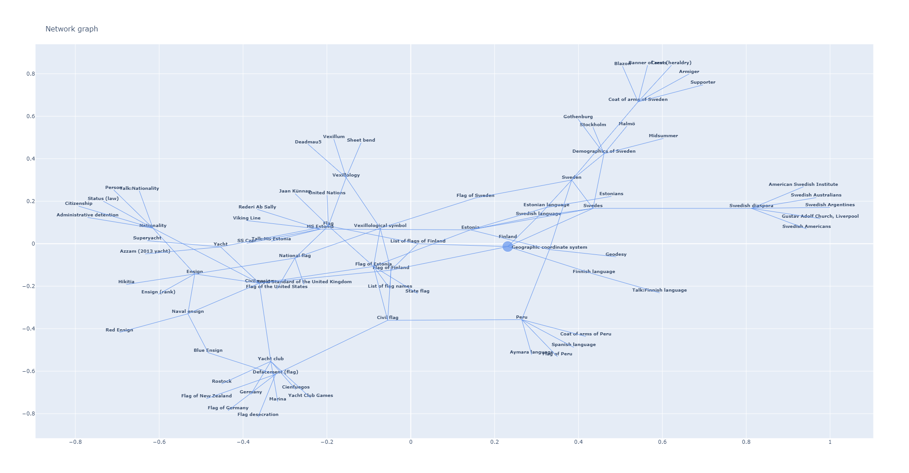

# Link grapher

Weekend project that started from the thought that what kind of a graph would Wikipedia pages form if **each node is a wiki page** and **each edge denotes that one page is linked to another**. Or if randomly starting from different pages, would the networks converge toward one or multiple pages? That is, is there a Wikipedia page that is linked to all (or most) other wikipedia pages?

## Problems:

As mentioned this was a quick weekend project and traversing the wikipedia pages using HTML requests isn't really the most efficient approach. On the other hand ````GET``` requests can't be done too fast and the number of pages grows very rapidly!

## How to fix / future ideas:

All of Wikipedia can be downloaded so handling this data locally is definitely how one should do it. Traversing all of Wikipedias pages would definitely need very efficient design and more powerful computer / computing cluster as there's more than 50 GB of data to handle containing more than 6 million articles! 


## Example output: 
Example output is a search starting from Finland's wikipedia page, which takes 5 links per page, and the depth is 4 (where 0 depth corresponds to Finland page, 1 the page after that, etc.). Creating the output took ```61``` seconds, and has 82 nodes, 101 edges and max degree of a node is 7 (number of edges out of a node). **The output can be seen in full detail by downloading wikipedia.html file and viewing it using a web browser** (this is an interactive Plotly plot). PNG Snapshot of this interactive plot is shown below:


---

## Project
### Dependencies
See ```requirements.txt```.
### Idea in a nutshell
```
Given a start page
    1. Find all links on it
    2. Create a node of current page and its links
        - Create edges between
    3. Move on to the linked pages
    
    Iterate until a predetermined depth level has been reached.
```
## Issues:
- Latest numpy 1.19.4 didnt work on newest python (3.9)?
    * Fix: Install previous numpy 1.19.3
  
## Some notes on Wikipedia links:
Wikipedia random page url is https://en.wikipedia.org/wiki/Special:Random. Note, links on wikipedia pages can be found inside paragraph ```<p>...</p>```, inside ```<a>...</a>``` tags as an attribute ```href```, i.e. ```<a href="LINK"> ...</a>```.
